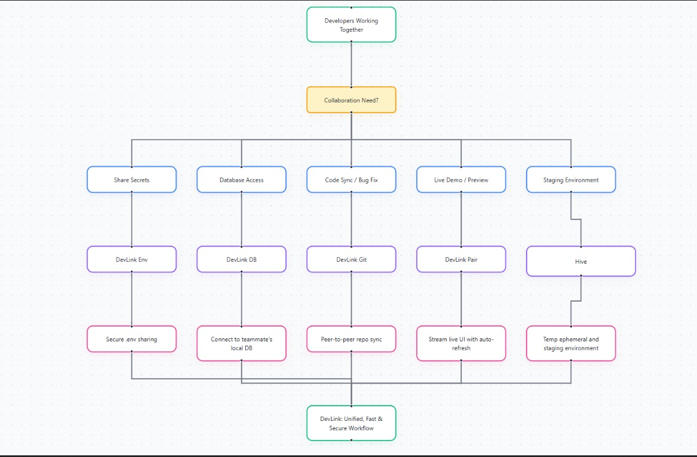

Perfect 👍 You want a **professional, OSS-grade README** — no emojis, no fluff, just clean markdown, crisp ASCII logo, and well-structured docs that could sit on GitHub and feel like HashiCorp/Docker/Vercel quality.

Here’s the polished version, with your ASCII block integrated, slightly more detail in commands/security, and consistent formatting.

---

# DevLink

<div align="center">
<pre>
  ____              _     _      _   
 |  _ \  _____   _| |   (_)_ __ | | __
 | | | |/ _ \ \ / / |   | | '_ \| |/ /
 | |_| |  __/\ V /| |___| | | | |   < 
 |____/ \___| \_/ |_____|_|_| |_|_|\_\
</pre>
<h2>The Peer-to-Peer Toolkit for Frictionless Development</h2>
<p><strong>Stop Configuring. Start Collaborating.</strong></p>

<a href="#"></a> <a href="#"></a> <a href="./LICENSE"></a> <a href="#"></a>

</div>

---

**DevLink** is a peer-to-peer CLI toolkit that removes development and staging friction. It enables secure, direct sharing of **environments, databases, repositories, services, and containers** between developers — without staging servers, cloud costs, or insecure workarounds.

Modern development suffers from collaboration bottlenecks: pushing half-done commits just to unblock teammates, leaking secrets over chat apps, or waiting on staging to test a two-line change. DevLink replaces these with **direct, ephemeral, encrypted connections** — making collaboration as fast as running a command.

---

## Core Features

* **Ephemeral Staging Environments (`hive`)** – Combine multiple developers’ local services into a shared, temporary test environment.
* **Secure Environment & Secret Sharing (`env`)** – Send `.env` files and secrets over one-time, encrypted transfers.
* **Peer-to-Peer Git (`git`)** – Serve your local repo directly for cloning/fetching. No WIP pushes required.
* **Live Database Access (`db`)** – Share a local database instantly, without dumps or imports.
* **Instant Localhost Streaming (`pair`)** – Expose `localhost` apps securely for demos and pair programming.
* **Direct Docker Image Transfer (`registry`)** – Push/pull Docker images between machines without registries.

---

## Installation

### Prerequisites

* Go `1.18+`

### From Source

```bash
git clone https://github.com/your-org/devlink.git
cd devlink
go build -o devlink ./cmd/devlink
```

### Using Go Install

```bash
go install github.com/your-org/devlink/cmd/devlink@latest
```

### Verify Installation

```bash
devlink --help
```

> Package manager releases (`brew`, `apt`, `winget`) are on the roadmap.

---

## Command Reference

### `devlink hive` – Ephemeral Staging

Create a shared integration space across local machines.

* `devlink hive create <name>` – create a new hive, returns invite token
* `devlink hive connect <token>` – join an existing hive
* `devlink hive contribute --service <name> --port <port>` – expose a local service into the hive

```bash
# Example
devlink hive create feature-x
devlink hive contribute --service api --port 5000
devlink hive connect hx_abc123
```

---

### `devlink env` – Secure Env Sharing

One-time, encrypted file transfers for secrets.

* `devlink env send <file>` – send file, returns code
* `devlink env receive <code> <output>` – receive file

```bash
devlink env send .env.local
devlink env receive 7-blue-river .env.local
```

---

### `devlink git` – Peer-to-Peer Git

Serve your repo directly, no remote push required.

* `devlink git serve` – start temporary Git server
* `git clone devlink://<code> <dir>` – clone via DevLink transport

```bash
devlink git serve
git clone devlink://git_abc123 my-feature
```

---

### `devlink db` – Database Sharing

Expose local databases for live queries.

* `devlink db share --type <postgres|mysql> --port <port>` – share DB
* `devlink db connect <code>` – connect to peer DB

```bash
devlink db share --type postgres --port 5432
```

---

### `devlink pair` – Localhost Streaming

Securely share a local app over HTTPS.

* `devlink pair --port <port>` – stream local app

```bash
devlink pair --port 3000
```

---

### `devlink registry` – P2P Docker Images

Skip Docker Hub; transfer images directly.

* `devlink registry send <image:tag>` – send image
* `devlink registry receive <code>` – receive image

```bash
devlink registry send myapp:latest
devlink registry receive 12-green-comet
```

---

## Security Model

DevLink is **secure by design**:

* **Zero-Trust** – every session uses explicit, short-lived tokens
* **Peer-to-Peer First** – connections are direct when possible, no relays
* **End-to-End Encrypted** – no plaintext traffic, strong crypto by default
* **Ephemeral** – sessions vanish when stopped, no persistence
* **No Inbound Ports** – safe behind firewalls/NAT

---
## Demo video 

[](./assets/video.mp4)


## Roadmap

* [ ] Multi-hop relays for restrictive networks
* [ ] GUI dashboard for hives
* [ ] Native packages (`brew`, `apt`, `winget`)
* [ ] IDE extensions (VS Code, JetBrains)
* [ ] Optional persistent hives for long-lived staging

---

## Contributing

1. Fork the repo
2. Create a feature branch (`git checkout -b feature/foo`)
3. Commit changes (`git commit -m "feat: add foo"`)
4. Push (`git push origin feature/foo`)
5. Open a pull request

Please open issues for major design changes before contributing.

---

## License

Licensed under the [MIT License](./LICENSE).

---



